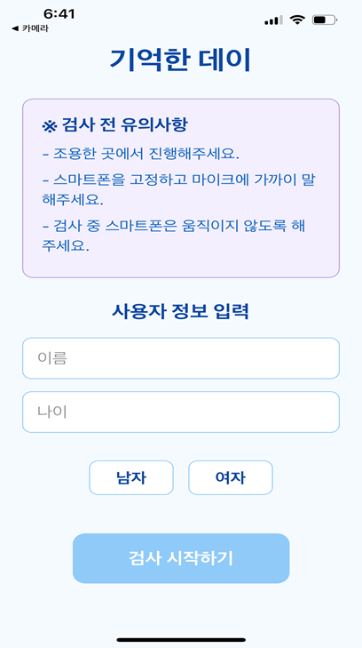
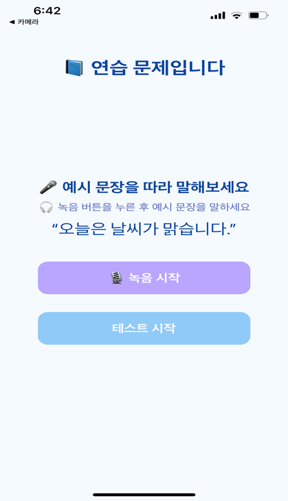
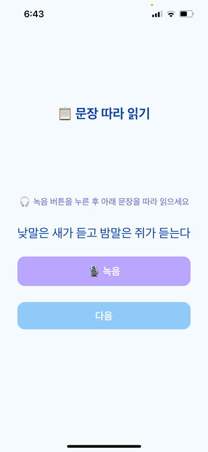
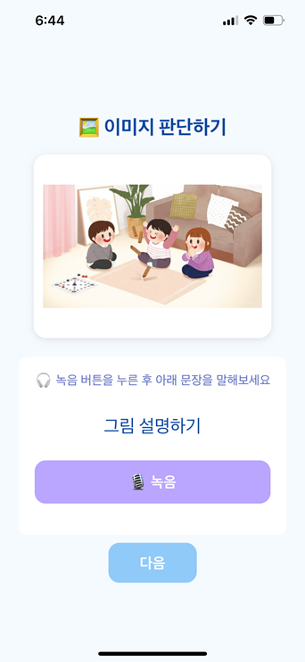
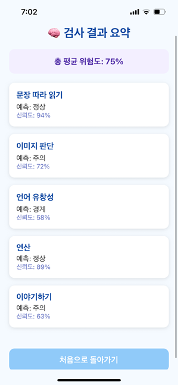

# 🌱 이음마켓(Eum Market)

지역소멸을 막기 위한 지역 간 경제 순환형 로컬 웹 쇼핑몰입니다.  
지역 특산물과 로컬 상품을 온라인에서 소개하고, 소비자가 지역별 상품을 탐색·구매하면서 지역 경제에 자연스럽게 참여할 수 있도록 만든 프로젝트입니다.

## 🧭 프로젝트 소개

이음마켓은 수도권 중심 소비 구조에서 벗어나 지역 상품의 접근성을 높이는 것을 목표로 합니다. 사용자는 지역별 상품을 탐색하고 장바구니에 담거나 바로 주문할 수 있으며, 지역별 판매 현황을 차트로 확인할 수 있습니다. 또한 판매자와 소비자가 소통할 수 있는 게시판 기능을 제공해 단순 쇼핑몰을 넘어 지역 상품 커뮤니티로 확장할 수 있는 구조를 갖췄습니다.

## ✨ 핵심 기능

### 👤 사용자 기능

- 회원가입 및 로그인
- JWT 기반 로그인 유지
- 사용자별 장바구니 조회, 추가, 수량 변경, 삭제
- 상품 바로 구매 및 장바구니 전체 구매
- 주문 내역 조회
- 회원 주소 기반 배송지 정보 조회

### 🛒 상품 기능

- 전체 상품 목록 조회
- 상품 상세 정보 조회
- 지역 카테고리별 상품 필터링
- 상품명 기반 검색
- 가격순, 이름순, 판매량순 정렬
- 지역별 판매량 통계 시각화

### 🌏 지역 경제 순환 기능

- 지역 카테고리 중심의 상품 탐색
- 상품별 `soldCount` 데이터를 활용한 지역 판매량 집계
- Chart.js 기반 지역별 판매 현황 차트 제공
- 판매량이 낮은 지역을 사용자가 인지하고 해당 지역 상품으로 이동할 수 있는 흐름 구성

### 💬 커뮤니티 기능

- 게시글 작성
- 게시글 목록 조회
- 게시글 상세 조회
- 작성자 기준 게시글 삭제
- 지역 상품 판매자와 소비자 간 소통 공간으로 활용 가능

## 🧰 기술 스택

### 🎨 Frontend

- React 19
- React Router DOM
- Zustand
- Chart.js
- CSS

### ⚙️ Backend

- Node.js
- Express
- MongoDB
- Mongoose
- JWT
- bcrypt
- CORS

### 💻 개발 환경

- Client: `http://localhost:3000`
- Server: `http://localhost:4000`
- Database: MongoDB

## 🗂️ 프로젝트 구조

```text
eum-market
├─ client
│  ├─ public
│  │  ├─ index.html
│  │  └─ manifest.json
│  ├─ src
│  │  ├─ component
│  │  │  ├─ AddressInput.js
│  │  │  ├─ EmailInput.js
│  │  │  ├─ Header.js
│  │  │  ├─ Footer.js
│  │  │  ├─ Searchbar.js
│  │  │  └─ SalesChart.js
│  │  ├─ pages
│  │  │  ├─ HomePage.js
│  │  │  ├─ CategoryPage.js
│  │  │  ├─ ProductDetailPage.js
│  │  │  ├─ SearchResultPage.js
│  │  │  ├─ Regionpage.js
│  │  │  ├─ Login.js
│  │  │  ├─ SignUp.js
│  │  │  ├─ MyPage.js
│  │  │  ├─ MyOrder.js
│  │  │  ├─ BoardPage.js
│  │  │  ├─ BoardWritePage.js
│  │  │  ├─ BoardDetailPage.js
│  │  │  └─ AboutPage.js
│  │  ├─ store
│  │  │  └─ cartStore.js
│  │  ├─ styles
│  │  ├─ utils
│  │  ├─ App.js
│  │  ├─ Router.js
│  │  └─ index.js
│  └─ package.json
│
├─ backend
│  ├─ data
│  │  └─ products.js
│  ├─ middleware
│  │  └─ authMiddleware.js
│  ├─ models
│  │  ├─ User.js
│  │  ├─ CartItem.js
│  │  ├─ Order.js
│  │  └─ BoardPost.js
│  ├─ routes
│  │  ├─ auth.js
│  │  ├─ products.js
│  │  ├─ cart.js
│  │  ├─ order.js
│  │  └─ boardRoutes.js
│  ├─ server.js
│  └─ package.json
│
└─ README.md
```

## 🖥️ 프론트엔드 구조

### 🧭 라우팅

`client/src/Router.js`에서 전체 페이지 라우팅을 관리합니다.

| 경로                | 화면              | 설명               |
| ------------------- | ----------------- | ------------------ |
| `/`                 | HomePage          | 메인 상품 목록     |
| `/login`            | Login             | 로그인             |
| `/signup`           | SignUp            | 회원가입           |
| `/mypage`           | MyPage            | 장바구니           |
| `/my-orders`        | MyOrder           | 주문 내역          |
| `/product/:id`      | ProductDetailPage | 상품 상세          |
| `/category/:region` | CategoryPage      | 지역별 상품        |
| `/search`           | SearchResultPage  | 상품 검색 결과     |
| `/region`           | Regionpage        | 지역별 판매량 통계 |
| `/board`            | BoardPage         | 게시판 목록        |
| `/board/write`      | BoardWritePage    | 게시글 작성        |
| `/board/:id`        | BoardDetailPage   | 게시글 상세        |
| `/about`            | AboutPage         | 서비스 소개        |

### 🔄 상태 관리

장바구니 상태는 `Zustand`를 사용해 `client/src/store/cartStore.js`에서 관리합니다.

- 서버에서 사용자별 장바구니 조회
- 상품 추가
- 수량 증가/감소
- 상품 삭제
- 변경 후 최신 장바구니 상태 반영

### 🧩 화면 구성

- `Header`: 로고, 검색창, 로그인 상태별 메뉴, 지역 카테고리 메뉴
- `HomePage`: 전체 상품 목록 출력
- `CategoryPage`: 지역별 상품 필터링 및 정렬
- `ProductDetailPage`: 상품 상세, 장바구니 담기, 바로 구매
- `MyPage`: 장바구니 목록, 수량 변경, 개별/전체 구매
- `MyOrder`: 주문 내역 및 배송지 확인
- `Regionpage`: 지역별 판매량 차트
- `BoardPage`: 게시글 목록 및 삭제
- `BoardWritePage`: 게시글 작성
- `BoardDetailPage`: 게시글 상세 조회

## 🏗️ 백엔드 구조

Express 서버는 `backend/server.js`에서 시작되며, 기능별 라우터를 `/api` 하위 경로로 분리했습니다.

```text
/api/auth      사용자 인증
/api/products  상품 목록
/api/cart      장바구니
/api/orders    주문
/api/board     게시판
```

### 🔌 주요 서버 로직

#### 🔐 인증

- 회원가입 시 이메일 중복 확인
- bcrypt를 사용한 비밀번호 해싱
- 로그인 성공 시 JWT 발급
- `Authorization: Bearer <token>` 형식으로 보호 API 접근
- `/api/auth/me`에서 현재 로그인 사용자 정보 조회

#### 🛍️ 장바구니

- JWT 토큰에서 사용자 ID를 추출해 사용자별 장바구니 관리
- 같은 상품을 다시 담으면 수량 증가
- 수량 증가, 감소, 직접 수정, 삭제 API 제공
- 장바구니 변경 후 최신 목록 반환

#### 📦 주문

- 로그인 사용자 기준 주문 생성
- 상품 목록을 주문 문서에 저장
- 최신 주문순으로 주문 내역 조회

#### 📝 게시판

- 게시글 등록
- 전체 게시글 최신순 조회
- 게시글 상세 조회
- 게시글 삭제

#### 🏷️ 상품

- `backend/data/products.js`의 로컬 상품 데이터를 API로 제공
- 상품 데이터에는 상품명, 가격, 지역 카테고리, 설명, 이미지, 판매량이 포함됩니다.

## 📡 API 명세

### 🔐 Auth

| Method | Endpoint           | 설명                    |
| ------ | ------------------ | ----------------------- |
| POST   | `/api/auth/signup` | 회원가입                |
| POST   | `/api/auth/login`  | 로그인 및 JWT 발급      |
| GET    | `/api/auth/me`     | 로그인 사용자 정보 조회 |

### 🏷️ Products

| Method | Endpoint        | 설명                |
| ------ | --------------- | ------------------- |
| GET    | `/api/products` | 전체 상품 목록 조회 |

### 🛍️ Cart

| Method | Endpoint                 | 설명                 |
| ------ | ------------------------ | -------------------- |
| GET    | `/api/cart`              | 사용자 장바구니 조회 |
| POST   | `/api/cart`              | 장바구니 상품 추가   |
| PUT    | `/api/cart/:id/increase` | 상품 수량 증가       |
| PUT    | `/api/cart/:id/decrease` | 상품 수량 감소       |
| PUT    | `/api/cart/:id`          | 상품 수량 직접 수정  |
| DELETE | `/api/cart/:id`          | 장바구니 상품 삭제   |

### 📦 Orders

| Method | Endpoint      | 설명                  |
| ------ | ------------- | --------------------- |
| POST   | `/api/orders` | 주문 생성             |
| GET    | `/api/orders` | 사용자 주문 내역 조회 |

### 📝 Board

| Method | Endpoint         | 설명             |
| ------ | ---------------- | ---------------- |
| POST   | `/api/board`     | 게시글 작성      |
| GET    | `/api/board`     | 게시글 목록 조회 |
| GET    | `/api/board/:id` | 게시글 상세 조회 |
| DELETE | `/api/board/:id` | 게시글 삭제      |

## 🗃️ 데이터 모델

### 👤 User

```js
{
  email: String,
  username: String,
  phone: String,
  password: String,
  address: String
}
```

### 🛍️ CartItem

```js
{
  userId: ObjectId,
  id: String,
  name: String,
  price: Number,
  quantity: Number,
  image: String
}
```

### 📦 Order

```js
{
  userId: ObjectId,
  items: [
    {
      id: String,
      name: String,
      price: Number,
      quantity: Number,
      image: String
    }
  ],
  createdAt: Date
}
```

### 📝 BoardPost

```js
{
  title: String,
  content: String,
  writer: String,
  createdAt: Date
}
```

## 🚀 실행 방법

### 1. 저장소 클론

```bash
git clone <repository-url>
cd eum-market
```

### 2. 백엔드 실행

```bash
cd backend
npm install
npm install mongoose jsonwebtoken dotenv
```

`backend/.env` 파일을 생성하고 아래 값을 설정합니다.

```env
MONGO_URI=<MongoDB 연결 문자열>
JWT_SECRET=<JWT 비밀키>
```

서버 실행:

```bash
node server.js
```

서버는 `http://localhost:4000`에서 실행됩니다.

### 3. 프론트엔드 실행

```bash
cd client
npm install
npm install chart.js
npm start
```

클라이언트는 `http://localhost:3000`에서 실행됩니다.

## 🎯 프로젝트에서 신경 쓴 부분

- 지역별 상품 카테고리를 중심으로 쇼핑몰의 목적성을 분명히 구성
- JWT 인증을 적용해 사용자별 장바구니와 주문 내역 분리
- 장바구니 상태를 전역 store로 관리해 여러 화면에서 일관된 데이터 흐름 유지
- 상품 판매량 데이터를 지역 통계로 재가공해 지역 경제 순환이라는 서비스 목표와 연결
- 프론트엔드 페이지와 백엔드 라우터를 기능 단위로 분리해 유지보수하기 쉬운 구조 구성

## 🛠️ 개선 예정

- 상품 데이터를 정적 파일이 아닌 MongoDB 컬렉션으로 이전
- 결제 API 연동
- 게시판 작성/삭제 권한 검증 강화
- 관리자 상품 등록 및 재고 관리 기능 추가
- 지역별 판매량 데이터 시각화 고도화
- UI 텍스트 인코딩 및 접근성 개선
- 배포 환경에 맞춘 API Base URL 분리

## 📱 시연 스크린샷

<p align="center">
  
  
  
</p>

<p align="center">
  
  
</p>
